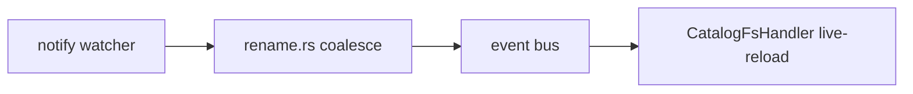

# Gramax MR Description

## Core principle

**First a short description with a link to the task. Then a subheading with important notes. That's it.**

No description + link + (if there are notes) explanation → MR review **does not pass** (hard block, see *Reviewer checklist*).
If you see no merge-blocking issues you can approve MR.

**Fix-MR is the link exception.** Bugfix: a task link is optional. Description + (optionally) a link to the bug source is enough: GitHub issue (`https://github.com/gram-ax/gramax/issues/...`), YouTrack (`https://support.ics-it.ru/issue/...`), Bugsnag (`https://app.bugsnag.com/...`). The description itself must clearly show the cause + fix — without it we don't accept the MR even for a fix.

## Auth & attribution

Writes to GitLab (creating/editing MRs, comments, API calls) use whatever token the environment provides — no prescription. The concrete commands (create/update MR, regular + inline comments, diverged-commits check) live in **[REFERENCE.md](REFERENCE.md)**.

**Exception — replies to MR/review comments always post as the bot** (bot token `GITLAB_CLAUDE_ACCESS_TOKEN`; on a dev machine that has both tokens, force it). Applies to answering review threads, resolving/pushing back on discussions, and any comment that responds to someone. New top-level MR content still follows the no-prescription rule above.

Because the comment is bot-authored, credit the human who triggered the run — append the initiator line to the comment body (personal token `GITLAB_ACCESS_TOKEN` / CI `GITLAB_USER_*`, cached, minimal output):

```sh
.claude/scripts/gitlab-initiator
# → Co-Authored-By: Pavel Smirnov <pavel.smirnov@ics-it.ru>
```

Ready-to-paste line. Subcommands: `nameemail`, `name`, `email`, `username`, `json`; `--refresh` clears the cache.

**Footer = `Assisted-By: <model display name>` — always.** Every MR / comment ends with an `Assisted-By:` line naming the model that did the work (e.g. `Assisted-By: Claude Opus 4.8`). Required, no exceptions — whatever token authored it.

In the templates below the footer = `Assisted-By: <model display name>`.

## Structure

MR description:

1. **Description** — 1–3 sentences, no heading, **in Russian** (title in English — see *Style rules*). What the user gets (US/Bug/Docs) or why we change it (Tech/Research/Epic/Fix). Right there/next — a link to the task in Gramax Board (`https://app.gram.ax/...`) or YouTrack (`https://support.ics-it.ru/issue/...`). Several tasks — a list of links (typical for ML/SOP/INT, whose tasks live in YouTrack). **Fix-MR without a task**: link is optional — GitHub issue / YouTrack / Bugsnag are allowed, or none if the fix is self-describing.
2. **`## Notes`** — non-obvious places: a non-standard solution, a subtlety, a workaround, an implicit dependency. Only what's hard for a reviewer/future-you to infer from the diff. None of that — omit the section.
3. Footer — `Assisted-By: <model display name>` (see *Auth & attribution*). Not needed if the MR was made entirely by a human without you.

`## What` is **not written** — the description replaces the heading.

## Optional sections

Add only if meaningful, after *Notes*:

- `## Architecture` — **required when the MR changes architecture** (new module/service/layer, moved responsibility, changed data flow, new interaction between components). A Mermaid diagram of the resulting shape — GitLab renders ` ```mermaid ` blocks natively. For a restructure show before/after (two diagrams or one with the removed path struck out). No architecture change — no section.
- `## Tests` — what you ran locally (unit/integration/Rust/E2E).
- `## Test plan` — checklist for the reviewer/QA.
- `## Tech` — architecture/implementation details. Tech/Research/Epic only.
- `## Screenshots` — before/after for UI.

## Style rules

- **Language: title in English, body in Russian.** The description, `## Notes`, and all other sections are written in Russian.
- **Terms are not translated.** Class names, commands, flags, and domain terms stay in English (watcher, frontmatter, live-reload, merge — as-is). RU+EN суржик is fine and expected — clarity beats language purity.
- **The whole point of the description is to make the essence of the change easy to grasp.** Optimize for the reader: what changed and why, in plain words. If a sentence doesn't help understanding — cut it.
- US-MR: description is about the user. No class names, paths, or flags.
- Tech/Research/Epic-MR: technical details allowed in the description + *Notes*.
- One meaning per MR. Several features — split the MR.
- Task link — bare URL or markdown link, required in the description. **Exception — Fix-MR**: link is optional (see *Core principle*).

## Template — US

```markdown
<1–3 предложения по-русски. Что пользователь теперь может делать/видеть.>
Task: <https://app.gram.ax/...>

## Notes
<Только сложные/нетипичные места в коде. Нет таких — убрать секцию.>

Assisted-By: <model display name>
```

## Template — Tech

```markdown
<Что меняется и зачем, по-русски. Смысл для разработчика.>
Task: <https://app.gram.ax/...>

## Notes
<Сложные места, workarounds, неявные зависимости. Опционально.>
```

## Template — Fix

Bugfix not tied to a board task. Link is optional.

```markdown
<1–3 предложения по-русски: симптом + причина + что делает фикс.>
<Опционально дальше: ссылка на источник бага.>
Issue: <https://github.com/gram-ax/gramax/issues/...>
<or> YouTrack: <https://support.ics-it.ru/issue/...>
<or> Bugsnag: <https://app.bugsnag.com/...>

## Notes
<Complex/atypical places. None — remove the section.>

Assisted-By: <model display name>
```

## Template — YouTrack (several tasks)

Tasks live in YouTrack (ML/SOP/INT/MOD/...) and the MR closes several related tickets:

```markdown
<1–3 предложения по-русски. Что меняется суммарно по всем задачам.>

Tasks:
- https://support.ics-it.ru/issue/ML-794
- https://support.ics-it.ru/issue/ML-797
- https://support.ics-it.ru/issue/ML-801

## Notes
<Optional>
```

Summarizing a YouTrack task (checking the diff matches the task) — skill `youtrack`: `bun .claude/skills/youtrack/scripts/youtrack.ts show --id ML-794`.

## Workflow

1. Find the task — ask for the link if missing. **No link, no MR.** Exception: Fix-MR — ask for a link to the bug source (GitHub/YouTrack/Bugsnag); no source → a self-describing description is enough.
2. Type (`US | Tech | Bug | Fix | Epic | Research | Docs`) — pick the template.
3. Description — **in Russian, title in English** (see *Style rules*). US → user outcome. Tech → cause + result for a developer.
4. Read the code: non-trivial places? List them in *Notes*. None — remove the section. Architecture changed → add `## Architecture` with a Mermaid diagram (see *Optional sections*).
5. Before writing: add the `Assisted-By: <model display name>` footer (see *Auth & attribution*). Create/edit the MR — commands in [REFERENCE.md](REFERENCE.md) → *Create / update MR*.
6. Someone else's MR — follow *Review workflow* below.

## Review workflow

**The order is mandatory.** Any review request on a Gramax MR (including `/requesting-code-review`, `/code-review`, `/review`, "посмотри MR", "ревью MR") enters here first. Steps 1–3 happen before reading any diff.

1. **First — read every linked source.** Open the task/issue/bug links in the MR description before anything else: Gramax Board (`board/` local file, see *Board task URL → local file*), YouTrack (`youtrack` skill: `bun .claude/skills/youtrack/scripts/youtrack.ts show --id <ID>`), GitHub issue (`gh issue view <N> --repo Gram-ax/gramax`), Bugsnag (`bugsnag` skill). Without the source you can't tell if the diff actually fixes the reported symptom or matches the task scope. No link at all on a non-Fix MR → that's already a checklist fail (step 2).
2. **Then — *Reviewer checklist (hard block)*.** Check description + task link + `## Notes`. Any item missing → step 3. **Do not delegate code review. Do not read the diff for review. Do not approve.** Separately — *Minor: source behind target* (not a blocker, see below): note it in a comment, but don't stop the review.
3. **Description fails** — one regular (not inline) comment using the *Missing description comment* template. Wait for the MR to be updated. The turn ends.
4. **Checklist passed** — delegate code review to the `caveman:cavecrew-reviewer` subagent. Don't do code review inline in the main thread.
5. **Code findings always as inline comments** on specific lines — inline-discussion command in [REFERENCE.md](REFERENCE.md) → *Inline comments* (`gh pr comment` for the GitHub mirror). One thread = one finding. Don't put several problems in one comment.
6. A summary comment — only if there are cross-file observations not tied to a line. Otherwise inline threads are enough.

Breaking the order (code review before checking the description) = breaking the convention, even if the code comments are useful.

## Inline comment style

- **One comment = one thread on one line.** No "and also on line 42 …" inside a thread.
- **No status emoji** (🔴🟡🟢, ❌✅, ⚠️). Severity — in text or not at all; priority reads from the wording.
- **Structure:**
  1. First paragraph — what's wrong (1–2 sentences, to the point).
  2. Second paragraph — the fix. A code block if appropriate.
- No "nice to have", "consider", "maybe" without explanation. If you propose it, justify it.

### Good inline example

```
`isStructuralFsPath` filters by `category.yaml`/`docroot.yaml`, but in this project
those files are named differently — `_index.md` (`CATEGORY_ROOT_FILENAME`) and `.doc-root.yaml`.
Because of this a change to `_index.md` goes into the `patch` branch and is lost.

Use the constants from `app/config/const.ts`:
​```ts
import { CATEGORY_ROOT_REGEXP, DOC_ROOT_FILENAMES } from "@app/config/const";
return CATEGORY_ROOT_REGEXP.test(name) || (DOC_ROOT_FILENAMES as readonly string[]).includes(name);
​```
```

### Bad inline example

```
🔴 Critical: hardcoded filenames + 🟡 also consider regex variants + 🟢 nit: rename var.
```

Why it's bad: three topics in one thread, status emoji, no fix.

## Missing description comment

No description / link / required `## Notes` — post a **regular** (not inline) comment:

```
The MR description does not pass the review checklist:

- [ ] Description (1–3 sentences, no heading, по-русски; title in English)
- [ ] Task link in Gramax Board (`https://app.gram.ax/...`) or YouTrack (`https://support.ics-it.ru/issue/...`) — **optional for Fix-MR**; GitHub issue / Bugsnag are allowed, or none if the fix is self-describing
- [ ] `## Notes` (if the diff has non-trivial places)
- [ ] `## Architecture` with a Mermaid diagram (if the diff changes architecture)

Details and templates: skill `mr` (see `gramax/.claude/skills/mr/SKILL.md`).
Update the description and ping for re-review.
```

Only the missing items stay as checkboxes. Code review is not done until the description is in order.

## Reviewer checklist (hard block)

Check BEFORE the code. Any item not done → **don't approve**, one comment listing what's missing + ask to update and re-run the review. The rule is not waived by deadline pressure, MR size, or "it's obvious anyway".

1. **Description** — 1–3 sentences at the top, no heading, **in Russian** (title in English, terms in English — see *Style rules*). US/Bug/Docs — what the user gets. Tech/Research/Epic — why we change it. A `## What` heading is forbidden.
2. **Task link** in Gramax Board (`https://app.gram.ax/...`) or YouTrack (`https://support.ics-it.ru/issue/<PROJECT-NNN>`) — in the description or right after. Several tasks — a list of links is allowed. **Fix-MR exception**: link is optional; GitHub issue (`https://github.com/gram-ax/gramax/issues/...`), YouTrack, Bugsnag are allowed, or none if the description is self-describing (symptom + cause + fix).
3. **`## Notes`** — there are non-obvious places in the diff → explained. None — omit the section, don't write `n/a`.
4. **`## Architecture`** — the diff changes architecture (new module/service/layer, moved responsibility, changed data flow) → a Mermaid diagram is required. No architecture change — section must be absent.

### Minor: source behind target (not a blocker)

Source lagging behind target is a **minor remark, not a hard block**. Don't stop the review, don't refuse approval over it. Branch is behind (`The source branch is N commits behind the target branch`) — just note it in a comment: suggest pulling merge/rebase target → source so the diff doesn't mix real changes with target-branch drift. Check via the diverged-commits API ([REFERENCE.md](REFERENCE.md) → *Diverged commits*) or by eye in the UI. Often it lags simply because target moved ahead — that's normal.

What you don't do (per hard-block items 1–3):

1. Don't approve.
2. One comment: list what to add + a link to the skill.
3. Wait for the update.

## Board task URL → local file

A link `https://app.gram.ax/gitlab.ics-it.ru/dr/gramax-board/<branch>/-/<path>` → read from workspace `board/`. Take the part after `/-/` (the extension is not shown in the URL), try two variants:

- file: `board/<path>.md`
- category: `board/<path>/_index.md`

Example: `.../epic/native-chtenie-kataloga/fs-watcher-live-reload` → `board/epic/native-chtenie-kataloga/fs-watcher-live-reload.md`.

## Examples

### Good — US

Title: `Copy media from desktop context menu`

```markdown
В desktop context menu теперь можно копировать media. Ссылки копируются с доменом `app.gram.ax` вместо `tauri.localhost`.

Task: https://app.gram.ax/gitlab.ics-it.ru/dr/gramax-board/master/-/uncategorized/desktop-context-menu

Assisted-By: Claude Opus 4.8
```

(The *Notes* section is omitted — no non-trivial places.)

### Bad — US

```markdown
## What
Swapped the URL in the clipboard handler via IPC. Added a hook in TauriContextMenu.
```

Why it's bad: a `## What` heading is forbidden, body in English instead of Russian, file/function names instead of meaning for the user, no task link.

### Good — Tech

Title: `Native FS watcher with FE live-reload`

````markdown
Нативный FS watcher + проводка событий на FE: live-reload frontmatter и контента текущей статьи, обновление left-nav, redirect при удалении статьи.
Task: https://app.gram.ax/...

## Notes
- `rename.rs`: Removed+Created в одном batch схлопываются в Renamed по basename, fallback — позиционный.
- `Article._loadContent` перечитывает `_props` — иначе frontmatter оставался stale после invalidateContent.
- Точечный patch вместо полного re-parse: сохраняет item-ID, важно для undo/redo.

## Architecture


## Tests
- Rust: `cargo check --workspace --all-targets`, rename 6/6, `watch.rs` green.
- JS: `CatalogFsHandler.unit.test.ts` 10/10.

Assisted-By: Claude Opus 4.8
````
